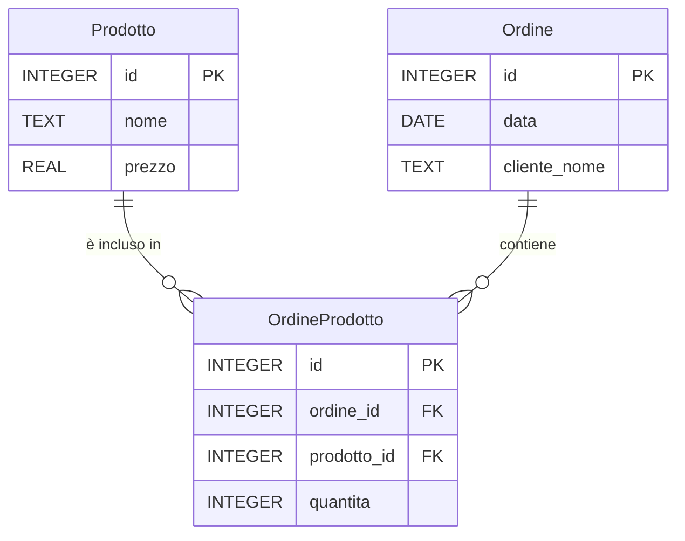

# VERIFICA DI RECUPERO — Modellazione ER e SQL

## Esercizio 1 — Biblioteca di quartiere

### Scenario
La biblioteca di quartiere "Pagine Aperte" presta libri agli iscritti e organizza anche eventi culturali. Ogni sede della biblioteca è identificata da un codice, ha un indirizzo e si trova in una città precisa.

I libri sono identificati da un codice, hanno un titolo, un anno di pubblicazione e un prezzo di copertina. Un libro può avere uno o più autori, e un autore può aver scritto più libri.

Gli iscritti possono prendere in prestito libri. Per ogni prestito si registra la data di inizio e la data di restituzione effettiva. Ogni prestito avviene presso una sede specifica.

La biblioteca organizza anche eventi, come presentazioni e laboratori. Ogni evento ha una data, un titolo e si svolge in una specifica sede.

### Richiesta
Progettare un modello ER che rappresenti la situazione descritta e che permetta di rispondere a domande come:
- quali libri ha scritto un determinato autore;
- quali prestiti risultano ancora non restituiti;
- quali prestiti sono stati effettuati presso una determinata sede;
- quali libri ha preso in prestito un iscritto.

### Consegna
Salvare il diagramma in un file `.mmd` usando Mermaid.

### Nota tecnica
Per le annotazioni nel diagramma ER, utilizzare il carattere `%%` seguito dal commento.

---

## Esercizio 2 — Gestione ordini semplice

### Scenario
Un piccolo negozio online tiene traccia dei prodotti venduti e degli ordini effettuati dai clienti. Il dominio è ridotto per semplificare il lavoro.

I prodotti hanno un codice, un nome e un prezzo. Gli ordini registrano la data e il nome del cliente che li ha effettuati; ogni ordine può contenere più prodotti con quantità diverse.

### Modello ER

### Compiti
1. Scrivere gli statement SQL `CREATE TABLE` per le tre tabelle principali: `Prodotto`, `Ordine` e `OrdineProdotto`.
2. Inserire i record di esempio indicati sotto usando `INSERT`.
3. Scrivere le query di esempio richieste.

### Dati da inserire
- **Prodotti** (5 record):
  - `(1, 'Notebook', 12.5)`
  - `(2, 'Penna a sfera', 1.2)`
  - `(3, 'Zaino', 28.0)`
  - `(4, 'Agenda', 7.5)`
  - `(5, 'Quaderno', 5.0)`

- **Ordini** (3 record):
  - `(1, '2025-10-01', 'Anna Verdi')`
  - `(2, '2025-10-02', 'Marco Neri')`
  - `(3, '2025-10-03', 'Anna Verdi')`

- **OrdineProdotto** (5 record):
  - `(1, 1, 1, 2)`
  - `(2, 1, 2, 5)`
  - `(3, 2, 3, 1)`
  - `(4, 3, 4, 2)`
  - `(5, 3, 2, 3)`

### Query richieste
Fornire per ogni punto una breve descrizione e la relativa query SQL:
- elenco dei prodotti che costano meno di 10;
- elenco dei prodotti contenuti in un determinato ordine;
- numero di ordini per ogni cliente;
- media dei prezzi dei prodotti;
- totale speso per ogni cliente.

### Consegna
Caricare un file `.sql` contenente:
- i comandi `CREATE TABLE`;
- tutti gli `INSERT` richiesti;
- le query di esempio.